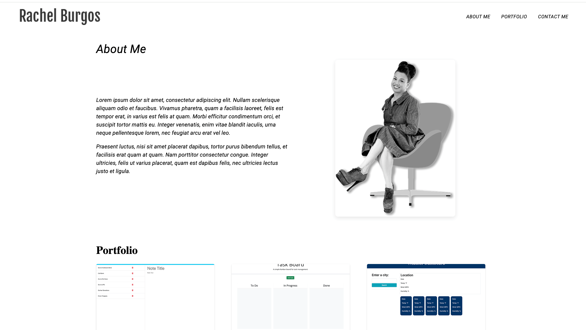

# React + Vite

# React Portfolio

 <!-- Replace with actual path to a screenshot image -->

A personal portfolio built with React to showcase projects, skills, and contact information. The portfolio is designed with Material-UI for a modern, responsive layout and includes smooth scrolling and interactive sections.

## Table of Contents
- [Features](#features)
- [Demo](#demo)
- [Installation](#installation)
- [Usage](#usage)
- [Technologies Used](#technologies-used)
- [Contributing](#contributing)
- [License](#license)

## Features

- **Responsive Layout**: Adapts to various screen sizes for an optimal viewing experience.
- **Smooth Scrolling**: Scroll to sections (About Me, Portfolio, Contact) with smooth transitions.
- **Contact Form**: Users can submit their contact information with validation.
- **Portfolio Showcase**: Displays project cards with descriptions, technologies used, and links to live projects or GitHub repositories.
- **Reusable Components**: Organized structure with reusable components for easy maintenance and scaling.

## Demo

You can check out the live demo of this portfolio 
.

## Installation

1. **Clone the repository:**
   ```bash
   git clone https://github.com/rachelb36/react_portfolio.git
   cd react_portfolio

2. Install Dependencies
`npm install `

3. Start the development server:
`npm run dev`

## Usage

**Navigation**: Use the navbar to navigate to sections like About Me, Portfolio, and Contact.
**Contact Form**: Users can submit their contact information and message.
**Project Cards**: Each project includes an image, description, technologies used, and links to the live app or GitHub repository.

## Technologies Used
**React**: JavaScript library for building the user interface.
**Material-UI**: React component library for modern and responsive design.
**React Scroll**: Smooth scrolling to specific sections.
**Git**: Version control for managing code changes.

License

This project is licensed under the MIT License.


